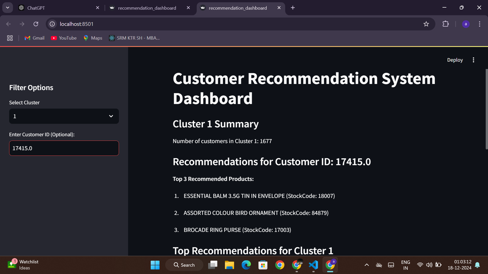
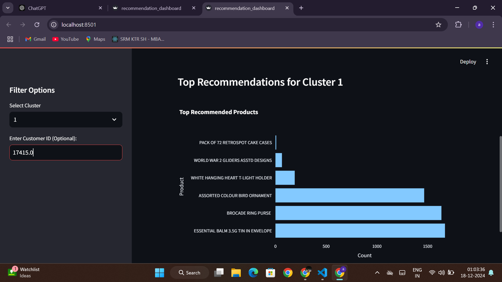

<!DOCTYPE html>
<html lang="en">
<head>
    <meta charset="UTF-8">
    <meta name="viewport" content="width=device-width, initial-scale=1.0">
    <title>Customer Segmentation and Recommendation System</title>
</head>
<body>
    <h1>Customer Segmentation and Recommendation System</h1>
    
This repository contains a machine learning-based customer segmentation and product recommendation system. It utilizes clustering techniques (KMeans) to segment customers and recommend products based on their purchasing behavior. The system is deployed via Streamlit as a web dashboard, providing a user-friendly interface for interacting with the recommendations.

    <h2>Table of Contents</h2>
    <ul>
        <li><a href="#project-description">Project Description</a></li>
        <li><a href="#setup-instructions">Setup Instructions</a></li>
        <li><a href="#project-structure">Project Structure</a></li>
        <li><a href="#dashboard-screenshot">Dashboard Screenshots</a></li>
    </ul>

    <h2 id="project-description">Project Description</h2>
    
This project aims to implement a customer segmentation and recommendation system to categorize customers based on their purchasing patterns. It then provides personalized product recommendations for each customer based on their cluster.

    <h3>Key Features</h3>
    <ul>
        <li>Customer segmentation using KMeans clustering</li>
        <li>Product recommendation system for personalized suggestions</li>
        <li>Interactive dashboard to explore recommendations</li>
    </ul>

    <h2 id="setup-instructions">Setup Instructions</h2>
    
Follow these steps to set up and run the project on your local machine:

    
    <h3>1. Clone the repository</h3>
    <pre><code>git clone https://github.com/SimranThakur0/Customer-Segmentation-and-Recommendation-System.git</code></pre>
    
    <h3>2. Create a virtual environment</h3>
    <pre><code>python -m venv venv</code></pre>
    
    <h3>3. Activate the virtual environment</h3>
    <pre><code>source venv/bin/activate  <!-- For Linux/macOS -->
    venv\Scripts\activate  <!-- For Windows --></code></pre>

    <h3>4. Install dependencies</h3>
    <pre><code>pip install -r requirements.txt</code></pre>

    <h3>5. Run the Streamlit dashboard</h3>
    <pre><code>streamlit run src/recommendation_dashboard.py</code></pre>

    <h2 id="project-structure">Project Structure</h2>
    <pre><code>
Customer-Segmentation-and-Recommendation-System/
│
├── models/                    # Folder containing model files and datasets
│   ├── customer_data_cleaned.csv  # Cleaned customer data
│   ├── customer_recommendations.csv  # Recommended products
│   └── kmeans_model.pkl  # Trained KMeans model
│
├── src/                       # Source code folder
│   ├── recommendation_dashboard.py  # Streamlit dashboard script
│   └── customer-segmentation-recommendation-system.ipynb  # Jupyter notebook for exploration
│
├── requirements.txt           # Required Python packages
└── README.md                  # Project documentation
    </code></pre>

    <h2 id="dashboard-screenshot">Dashboard Screenshots</h2>
    
Here are some screenshots of the interactive dashboard:

    <h3>Dashboard Overview</h3>
    

    <h3>Product Recommendations</h3>
    

    <h3>Top Recommended Products</h3>
    

    <h2>License</h2>
    
This project is licensed under the MIT License - see the <a href="LICENSE">LICENSE</a> file for details.

</body>
</html>
